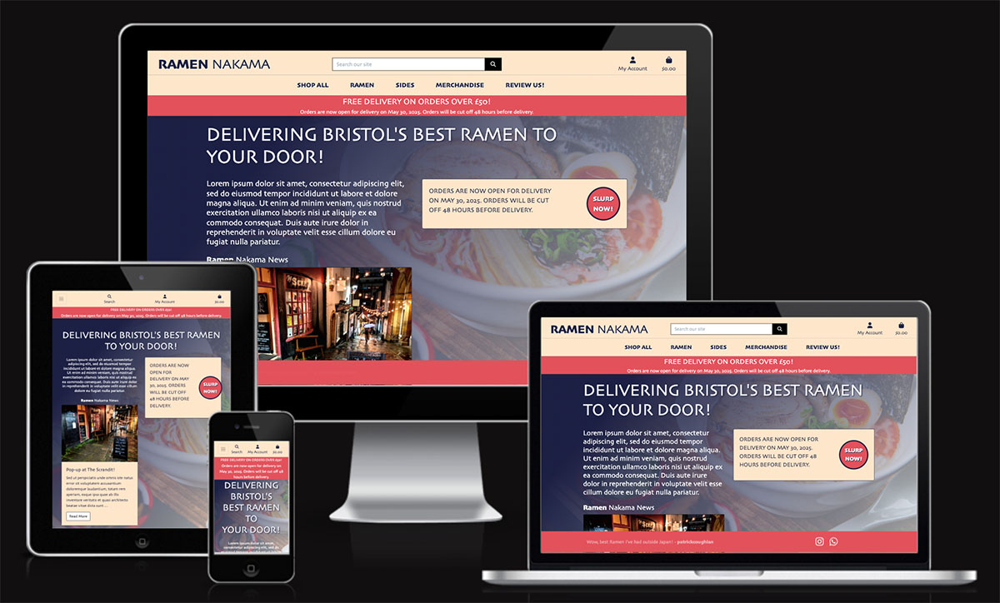
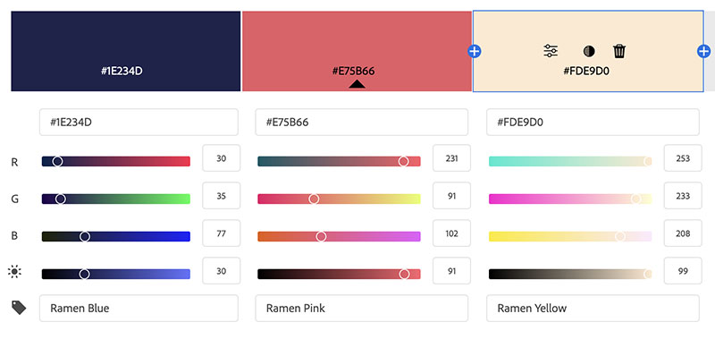
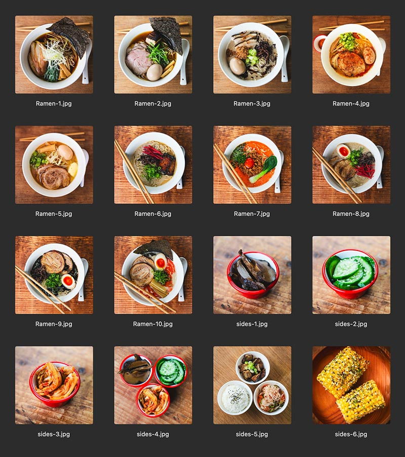
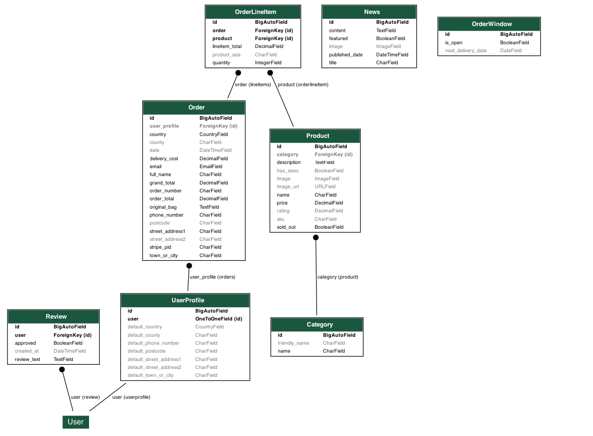
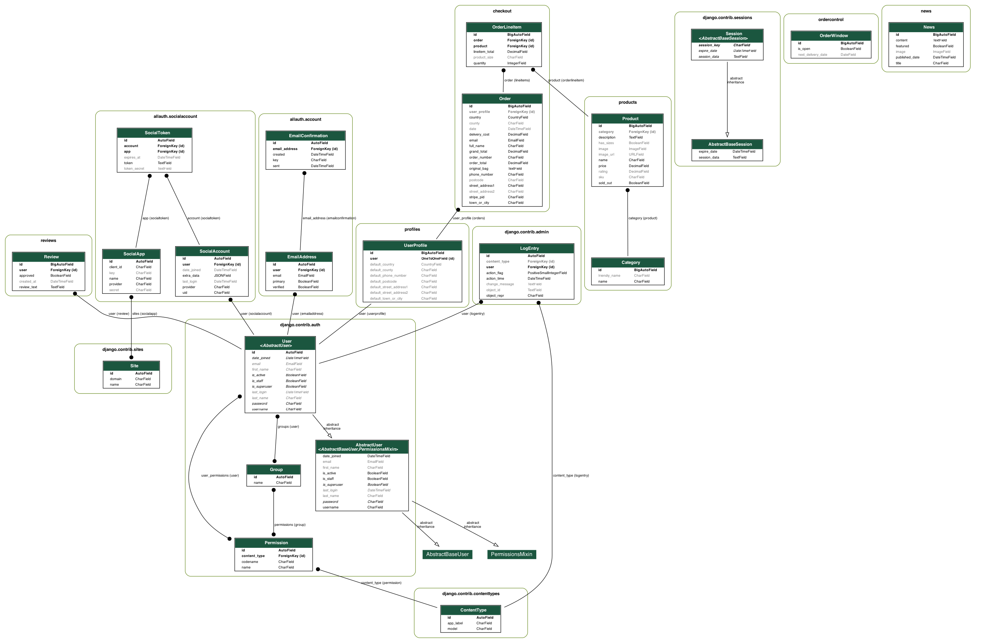

# Ramen Nakama



## Project Overview

**Ramen Nakama** is a full‑stack e‑commerce application built on Django that lets:

- **Customers**:
  - Register an account and manage their profile  
  - Browse today’s ramen menu and merchandise  
  - Place orders for a chosen delivery date  
  - View past orders  
  - Submit, edit, and delete free‑form reviews (pending approval before display)  

- **Administrators (Store Owner)**:
  - Manage products (add, edit, remove, toggle “sold out”)  
  - Publish news items that surface on the homepage (with an archive view)  
  - Enable or disable live ordering and announce upcoming delivery windows  

The app is deployed on **Heroku**, uses **AWS S3** for static/media hosting, and integrates **Stripe** for secure payment processing. Its responsive **Bootstrap**‑powered front end is supplemented with custom CSS for a distinctive look. Ramen Nakama extends Code Institute’s Boutique Ado template with bespoke models and workflows tailored to the demands of a modern ramen delivery service.


[View Site Here](https://milestone-four-ff783f75758e.herokuapp.com)

---

## Table of Contents

- [Features](#features)
- [Visual Design](#visual-design)
- [Technologies Used](#technologies-used)
- [Design and Development Tools](#design-and-development-tools)
- [Installation & Setup](#installation-and-setup)
- [Usage Instructions](#usage-instructions)
  - [For Customers](#for-customers)
  - [For Staff/Admin](#for-staffadmin)
- [Testing](#testing)
- [Testing Table](#testing-table)
- [User Stories](#user-stories)
- [Design Considerations](#design-considerations)
- [Entity Relationship Diagram (ERD)](#entity-relationship-diagram-erd)
- [Essential Future Improvements](#essential-future-improvements)
- [Other Future Improvements](#other-future-improvements)
- [Troubleshooting Highlights](#troubleshooting-highlights)
- [References and Credits](#references-and-credits)
- [License](#license)
- [Acknowledgements](#acknowledgements)

---

## Features

- **User-friendly Ordering:**  
  - Browse a selection of authentic ramen dishes, sides and merchandise (products to be added).
  - Add items to a shopping bag and check out seamlessly.
  
- **Review & Feedback System:**  
  - Customers can submit reviews (with an approval flow).
  - A dedicated “thank you” page for review submissions.

- **Dynamic News & Updates:**  
  - The homepage displays a summary of the latest news, managed by the superuser in the admin panel.
  - A news archive featuring an alternating two-column layout for images and text.

- **Responsive and Modern Design:**  
  - Built with Bootstrap 4 and enhanced with custom CSS.
  - Fully responsive layout for desktop, tablet, and mobile devices.

- **Secure Payment Processing:**  
  - Integrated with Stripe to handle payment intents and charge events.
  - Real-time triggers for key payment events.

---

## Visual Design

Overview of the visual and UX approach for Ramen Nakama, including layout, branding, typography, and responsiveness.


### Layout & Structure  
- **Grid System:** Built on a 12‑column Bootstrap grid.  
- **Two‑Column Sections:** Key content (e.g. news cards, feature calls) alternate image/text to keep the page dynamic.  
- **Hero Area:** Full‑width background image with gradient overlay ensures readability of the main headline and CTA.


### Colour Palette  
This palette comes straight from the store’s logo. Deeper integration of these colours into the overall site design is tracked under [Essential Future Improvements](#essential-future-improvements).

| Name         | HEX       | Usage                             |
|--------------|-----------|-----------------------------------|
| Ramen Blue   | `#1e234d` | Headers, nav links, borders       |
| Ramen Pink   | `#e75b66` | Primary CTAs, buttons, highlights |
| Ramen Yellow | `#fde9d0` | Background overlays, cards        |




### Typography  
Ramen Nakama uses the Skia CC family (via Adobe Fonts) to reinforce its brand personality:

- **Skia CC Regular (400):**  
  Applied to body copy, form labels, and secondary headings for clear legibility.  
- **Skia CC Bold (700):**  
  Used for primary headlines, buttons (e.g. “Slurp Now”), and key calls‑to‑action to establish hierarchy.


### Imagery & Icons  
- **Photography:** All product shots and site imagery (hero, dishes, merch) were photographed by the developer; only news‑item images come from external sources.  
- **Product Thumbnails:** Consistent aspect ratio and size for visual harmony.  
- **Icons:** Font Awesome for UI elements (search, user, cart) ensures scalability and crispness.

  


### UI Components & Overrides  
- **Buttons:**  
  - Circular “Slurp Now” in Ramen Pink with a Ramen Blue border.  
  - Full‑width on mobile; auto‑width on larger screens with flex layouts.  
- **Cards:**  
  - `.bg-light` and `.card-body` overridden to Ramen Yellow for consistency.  
  - Soft shadows and 2xl rounded corners for a modern look.  
- **Forms:**  
  - Crispy‑Forms with black borders, square corners, and custom placeholder styling.


### Responsive Behavior  
- **Container Width:** Max‑width set to 80% on extra‑large screens (≥1200px).  
- **Header Padding:** Adjusts between desktop (`164px`) and mobile (`116px`) to accommodate fixed elements.  
- **Button & Text Scaling:** Font sizes and padding adjust via media queries to ensure tap‑target accessibility on mobile.  


### Screenshots

#### Desktop View  
  
*Homepage at 1440px showing hero, news card, and “Slurp Now” CTA.*

#### Tablet View  
  
*Two‑column news and features on a tablet‑sized viewport.*

#### Mobile View  
  
*Single‑column flow on mobile, central CTAs and easy scroll.*

---

## Technologies Used

#### Backend & Deployment  
[](https://www.djangoproject.com/)
[](https://www.heroku.com/)
[](https://aws.amazon.com/s3/)
[](https://stripe.com/)

#### Frontend Technologies  
[](https://developer.mozilla.org/en-US/docs/Web/Guide/HTML/HTML5)
[](https://developer.mozilla.org/en-US/docs/Web/CSS)
[](https://developer.mozilla.org/en-US/docs/Web/JavaScript)
[](https://getbootstrap.com/)

#### Database Solutions  
[](https://www.postgresql.org/)
[](https://www.sqlite.org/index.html)

---

## Design and Development Tools

#### Code Editors & Version Control  
[](https://code.visualstudio.com/)
[](https://git-scm.com/)
[](https://github.com/)

#### Design & Branding  
[](https://www.figma.com/)
[](https://www.adobe.com/products/photoshop.html)
[](https://fontawesome.com/)
[](https://fonts.adobe.com/)

---

## Installation & Setup
---

## Usage Instructions

### For Customers

1. **Register & Log In**  
   - Click “My Account” in the navbar.  
   - Choose **Register** (or **Login** if you already have an account).  
   - Fill out the signup form (username, email, password), then verify via the confirmation email.

2. **Browse & Search**  
   - From the homepage, click **Shop All** or use the search icon to find specific dishes or merchandise.  
   - Filter by category (Ramen, Sides, Merchandise) or sort by price/rating.

3. **Add to Bag**  
   - On a product page, select any available options (e.g. size) and click **Add to Bag**.  
   - A toast notification will confirm your selection.

4. **View & Edit Bag**  
   - Click the bag icon in the navbar to view your current order.  
   - Adjust quantities or remove items directly in the bag summary.

5. **Checkout**  
   - From the bag page, click **Checkout**.  
   - Enter your saved delivery details or update your address.  
   - Select a delivery date from the open ordering window.  
   - Complete payment securely via Stripe.

6. **Order Confirmation & History**  
   - After successful payment, you’ll see a confirmation page with an order number.  
   - In your profile, click **Order History** to review past orders and quickly reorder if desired.  

7. **Submit a Review**  
   - Once your order arrives, navigate to **Review Us!** in the navbar (or from your profile).  
   - Fill out the free‑form review form and submit.  
   - You’ll be redirected to a “Thank You” page confirming your submission.  

  
*Customer browsing the menu and adding items to their bag.*  

  
*Checkout form with delivery date picker and Stripe payment.*  

---

### For Staff / Admin

1. **Access the Admin Portal**  
   - Go to `/admin` and log in with your superuser credentials.

2. **Manage Products**  
   - Under **Products**, you can **Add**, **Edit**, or **Delete** menu items and merchandise.  
   - Toggle **Sold Out** to instantly prevent ordering of out‑of‑stock items.

3. **Configure Ordering Window**  
   - In **Delivery Windows**, create or modify open periods for customer ordering.  
   - Use the **Enable/Disable Ordering** toggle to open or close the shop.

4. **Publish News & Announcements**  
   - Under **News**, create new “cards” with a title, image, and text.  
   - Saved items appear immediately on the homepage; older items move to the archive.

5. **Review Moderation**  
   - Under **Reviews**, approve or reject customer reviews before they appear in the homepage ticker.  
   - Pending reviews display a “Pending” badge in the admin list.

6. **View Orders & Reports**  
   - Under **Orders**, review incoming orders, export data, or mark fulfilled.  
   - Use filtering by date or status to monitor sales trends.

  
*Admin interface for creating and editing products.*  

  
*Admin view for publishing news items and managing the archive.*  


---

## Manual Testing

Ramen Nakama was manually exercised across all major features, devices, and browsers to ensure a smooth user experience. The table below summarizes each scenario, the expected behavior, the actual result, and any pertinent notes.

| Test Condition                                             | Expected Outcome                                                                                   | Result | Notes                                                       |
|------------------------------------------------------------|----------------------------------------------------------------------------------------------------|--------|-------------------------------------------------------------|
| **Logo Presence & Home Link**                              | Logo appears in the header of every page; clicking it returns to the homepage.                     | Pass   | Verified on different pages.                              |
| **Main Navigation**                                        | All primary links (Home, Shop All, Ramen, Sides, Merch, Review Us!) are visible and navigate correctly. | Pass   | Dropdown menus open without overlap.                        |
| **Mobile Nav Icons**                                       | Search, Account, and Bag icons remain on a single line and shrink as viewport narrows.             | Pass   | Tested down to 320 px width.                                |
| **Search Functionality**                                   | Entering a keyword returns matching products; no matches yields a “no results” message.            | Pass   | Checked partial and exact matches.                          |
| **Category Filters**                                       | Selecting “Ramen”, “Sides”, or “Merchandise” filters products accordingly.                         | Pass   | Verified each category combination.                         |
| **Sorting Options**                                        | Products sort by price (asc/desc) and rating (desc) when chosen.                                   | Pass   | Tested with mixed-price dataset.                            |
| **Product Detail Page**                                    | Detail page displays name, image, description, price, and “Add to Bag” (unless sold out).          | Pass   | “Sold Out” overlay appears correctly.                       |
| **Add to Bag**                                             | Clicking “Add to Bag” on product or from listing shows toast and updates bag icon total.            | Pass   | Quantities reflect correctly in toast and badge.            |
| **Bag Management**                                         | On the Bag page, quantities can be increased/decreased and items removed, updating totals instantly. | Pass   | Edge cases: zero quantity prevented.                        |
| **Checkout Date Picker**                                   | Only active delivery dates (per OrderWindow) are selectable; past/closed dates disabled.           | Pass   | Verified switching OrderWindow on/off.                      |
| **Stripe Payment Simulation**                              | Trigger `payment_intent.succeeded` → payment accepted, order created, confirmation email logged.   | Pass   | Used Stripe CLI triggers.                                   |
| **Order Confirmation**                                     | After payment, user sees a confirmation page showing the order number and summary.                 | Pass   | Order number matches DB record.                             |
| **Order History**                                          | Profile “Order History” lists all past orders with clickable order numbers linking to details.      | Pass   | Empty state shows “No orders yet.”                          |
| **Review Submission**                                      | Logged‑in users can submit reviews; invalid (blank) input raises form errors.                      | Pass   | Redirect to “Thank You” page on success.                    |
| **Review Moderation & Ticker**                             | Admin‑approved reviews appear in homepage ticker; unapproved reviews do not.                       | Pass   | Ticker cycles smoothly; pending reviews hidden.             |
| **Review Edit/Delete**                                     | Editing a review resets it to “Pending”; deleting removes it from both profile and ticker.          | Pass   | Confirm dialog appears before deletion.                     |
| **News Item Display**                                      | Latest news item (title, image, excerpt) appears on homepage; “Read More” links to archive.         | Pass   | Link navigates correctly to archive view.                   |
| **News Archive Layout**                                    | Archive pages paginate items; odd/even rows alternate image/text in two columns, responsive on mobile. | Pass   | Verified on desktop and mobile.                             |
| **Responsive Breakpoints**                                 | Layout adjusts at ≥1200 px (two‑column), 768–1199 px (stacked where necessary), ≤767 px (single‑column). | Pass   | No horizontal scroll at any breakpoint.                     |
| **Cross‑Browser Compatibility**                            | Core flows work identically in Chrome, Firefox, Safari, and Edge on desktop and mobile.           | Pass   | Interaction tests performed on each.                        |
| **Image Alt Text**                                         | All product, news, and decorative images include descriptive `alt` attributes.                     | Pass   | Screen-reader inspection confirmed.                         |
| **Keyboard Navigation**                                    | Users can tab through links, buttons, forms, and dropdowns; Enter/Escape operate menus.            | Pass   | Focus styles visible; no dead‑ends in navigation.           |


---

## User Stories & Acceptance Criteria

### 1. Customer – Browse & Order  
**Story:**  
As a customer, I want to browse all products, add items to my bag, select a delivery window, and pay via Stripe so that I can complete my order quickly and securely.  
**Acceptance Criteria:**  
- Can view and filter products by category or search.  
- Can add/remove items in a bag and see real‑time totals.  
- Can choose a valid delivery date and pay with Stripe.  
**Fulfilment:**  
- “Shop All” dropdown, category pages, and search icon; bag page with quantity controls; checkout form prefilled with profile data, date picker restricted by `OrderWindow`, Stripe integration, confirmation page, and order history.

---

### 2. Customer – Account Management  
**Story:**  
As a customer, I want to register, log in, and manage my delivery details so that I have a personalized ordering experience.  
**Acceptance Criteria:**  
- Can sign up, verify email, and log in.  
- Can view and update default delivery information.  
- Can see past orders.  
**Fulfilment:**  
- Django‑Allauth for signup/login; profile page with `UserProfileForm` for address, table of past orders with links to details.

---

### 3. Customer – Review Workflow  
**Story:**  
As a customer, I want to submit, edit, or delete my reviews so that I can share and update feedback on my orders.  
**Acceptance Criteria:**  
- Only logged‑in users access the review form.  
- After submit, see a “Thank You” page.  
- Can edit/delete reviews from profile; edits reset approval.  
**Fulfilment:**  
- `submit_review` view with `@login_required` and redirect to `review_success`; profile lists `Review` objects with Edit/Delete links; `review_edit` view sets `approved=False`; admin approves before homepage ticker.

---

### 4. Admin – Product & Inventory Management  
**Story:**  
As the site owner, I want to manage products and mark sold‑out items so that availability is accurate.  
**Acceptance Criteria:**  
- Can create/edit/delete products in admin.  
- Sold‑out products cannot be ordered and display an overlay.  
**Fulfilment:**  
- `Product` registered in Django admin; `.sold-out-overlay` CSS greys out images and hides “Add to Bag” buttons.

---

### 5. Admin – Ordering Window Control  
**Story:**  
As the site owner, I want to open/close ordering windows and set announcement messages so that customers know when they can order.  
**Acceptance Criteria:**  
- Can toggle an `OrderWindow.active` flag and edit `ordering_message`.  
- Homepage banner and CTAs appear only when active.  
**Fulfilment:**  
- `OrderWindow` model in admin; `ordercontrol.context_processors.order_status` injects current window; templates conditionally render banner and “Slurp Now” button.

---

### 6. Admin – News & Announcements  
**Story:**  
As the site owner, I want to publish news items and archive older ones so that I can keep customers informed.  
**Acceptance Criteria:**  
- Can add title, image, and content for news in admin.  
- Latest item shows on homepage; archive paginates in alternating layout.  
**Fulfilment:**  
- `News` model registered; homepage partial queries latest item; `NewsArchiveView` with pagination and `news_archive.html` flex layout alternating image/text.

---

### 7. Admin – Review Moderation  
**Story:**  
As the site owner, I want to approve or reject reviews so that only appropriate feedback appears.  
**Acceptance Criteria:**  
- Admin can toggle `Review.approved`.  
- Only approved reviews appear in the homepage ticker.  
**Fulfilment:**  
- `Review` model in admin list with approval toggle; `approved_reviews` context processor filters for homepage; jQuery cycle shows approved reviews only.

---

### 8. Cross‑Cutting – Responsiveness & Accessibility  
**Story:**  
As any user, I want the site to adapt across devices and support keyboard navigation and sufficient color contrast.  
**Acceptance Criteria:**  
- Layout reflows at Bootstrap breakpoints; icons and text scale for mobile.  
- All interactive elements accessible via keyboard; color contrast meets WCAG AA.  
**Fulfilment:**  
- Bootstrap grid with custom media queries; mobile nav flex-nowrap; semantic HTML with focus styles; contrast ratios verified with WebAIM tools.


---

## Design Considerations

- **Architectural Decisions:**  
  Modular Django apps for scalability and maintainability.
  
- **Responsive Design:**  
  Bootstrap 4 ensures the site adapts to all device types.
  
- **User Experience:**  
  Minimal clicks for ordering and submitting reviews with clear feedback.

- **Deployment & Maintenance:**  
  Deployed on Heroku, with AWS S3 for static and media file hosting.

---

## Entity Relationship Diagram (ERD)

This diagram illustrates the relationships between our core data models:

- **UserProfile** extends Django’s built-in User and can have multiple **Order**s.  
- Each **Order** comprises one or more **OrderLineItem**s, which reference individual **Product**s.  
- **Product**s are grouped by **Category** for easy filtering and display.  
- Stand-alone models **News** and **OrderWindow** power the homepage announcements and ordering window logic.  
- **Review** entries link back to the User who submitted them, appearing in both the profile and the homepage ticker once approved.



### Under the Hood – Django’s Built-in Models

In addition to our six custom apps, the “Full ERD” includes Django’s core tables that power authentication, permissions, admin, and sessions:

- **auth_user**  
  The primary user table holding credentials, email, and basic profile info.

- **auth_group** & **auth_permission**  
  Define named role groups and granular permissions; users can belong to any number of groups, each granting a set of permissions.

- **django_content_type**  
  Tracks all installed models (by app and model name) so that permissions and generic relations can reference them dynamically.

- **django_session**  
  Persists logged-in sessions, enabling “remember me” and cross-request authentication.

- **admin_log**  
  Records all CRUD actions taken in the Django admin interface, linking back to both the actor (auth_user) and the affected content type.

By layering our **UserProfile**, **Order**, **Product**, **News**, **OrderWindow**, and **Review** models on top of Django’s builtin tables, we reuse battle-tested authentication and permission logic while keeping our business-specific data neatly separated.  



## Data Models

### 1. UserProfile (`profiles/models.py`)
- **Extends** Django’s built-in `User` via a one-to-one link.  
- Stores default delivery info (phone, street, city, country, etc.).  
- A `post_save(User)` signal automatically creates or updates the profile on registration.  
- **Relation:** `Order.user_profile` → lets you fetch a customer’s past orders via `user_profile.orders.all()`.

---

### 2. Category & Product (`products/models.py`)
- **Category**  
  - Lookup table for product groupings (e.g. “Meat Ramen,” “Sides,” “Merchandise”).  
- **Product**  
  - ForeignKey → `Category`  
  - Fields: `sku`, `name`, `description`, `price`, optional `rating`, image(s), and `sold_out` flag.  
- **Relation:** `OrderLineItem.product` → ties each line-item back to its `Product`.

---

### 3. Order & OrderLineItem (`checkout/models.py`)
- **Order**  
  - UUID-based `order_number` generated on save.  
  - Captures buyer details, timestamp, Stripe payment ID, and raw bag JSON.  
  - Methods to compute `order_total`, conditional delivery fees, and `grand_total`.  
  - **Relation:** FK → `UserProfile` (nullable), `related_name='orders'`.  
- **OrderLineItem**  
  - FK → `Order` (`related_name='lineitems'`) and FK → `Product`.  
  - Auto-calculates `lineitem_total = product.price × quantity` in `save()`.  
  - **Relation:** Enables `order.lineitems.aggregate(Sum('lineitem_total'))`.

---

### 4. News (`news/models.py`)
- Fields: `title`, `content`, optional `ImageField(upload_to='news/')`, `published_date` (default `now`), and `featured` flag.  
- Meta: `ordering = ['-published_date']` for newest-first.  
- **Relation:** No foreign keys—used in homepage “latest news” and paginated archive.

---

### 5. OrderWindow (`ordercontrol/models.py`)
- Controls live ordering windows:  
  - `is_open` boolean + `next_delivery_date`.  
  - `is_ordering_active` property returns `True` only if ordering is open and now is more than 48 hours before `next_delivery_date`.  
  - `ordering_message` property generates context-aware banners (“Place your order for…”, “Ordering is closed…”).  
- **Relation:** Exposed via a context processor to every template to toggle banners and CTAs.

---

### 6. Review (`reviews/models.py`)
- FK → Django `User`, `review_text`, `created_at`, `approved` flag.  
- Workflow:  
  1. User submits → saved with `approved=False`.  
  2. Admin toggles `approved=True` in Django admin.  
  3. Approved reviews injected into the homepage ticker via context processor.  
- **Relation:** Linked to `User`, shown in both profile and homepage ticker.

---

### Overall Relationships
1. **Users** → one-to-one → **UserProfile**  
2. **UserProfile** → one-to-many → **Order**  
3. **Order** → one-to-many → **OrderLineItem** → many-to-one → **Product**  
4. **Product** → many belongs to → **Category**  
5. **News** and **OrderWindow** are standalone models powering site content and ordering logic.  
6. **Review** → FK → **User**, displaying approved feedback site-wide.

This modular structure leverages Django’s auth system, cleanly separates concerns, and remains readily extensible (e.g. attaching reviews to products or adding a Wishlist model in the future).  

---

## Essential Future Improvements

- **Enhanced Payment Flow:**  
  Integrate more robust error handling and notifications for payment issues.
  
- **Mobile Optimization:**  
  Further refine mobile UX beyond Bootstrap defaults.
  
- **User Account Features:**  
  Implement wishlists and order tracking.

---

## Other Future Improvements

- **New Content Types:**  
  Ideas for Mailing List integration and additional user feedback models.
  
- **Real-time Updates:**  
  Consider WebSockets or AJAX for live order tracking and notifications.

---

## Troubleshooting Highlights

1. **Invalid `` Tag**  
   - **Problem:** Templates threw `Invalid block tag: 'break'`.  
   - **Diagnosis:** Error log showed Django doesn’t support `` in loops.  
   - **Fix:** Replace the loop+break with the slice filter:  
     ```django
      … 
     ```

2. **Missing `news_detail.html` Template**  
   - **Problem:** `TemplateDoesNotExist: news_detail.html`.  
   - **Diagnosis:** Template‑loader postmortem showed Django looked in `templates/` and `templates/news/`.  
   - **Fix:** Either move `news_detail.html` into `templates/` or update the view to  
     ```python
     template_name = 'news/news_detail.html'
     ```

3. **NoReverseMatch: ‘news-detail’ Not Found**  
   - **Problem:** Clicking “Read More” raised `Reverse for 'news-detail' not found`.  
   - **Diagnosis:** The URL pattern for the detail view wasn’t defined.  
   - **Fix:** In `news/urls.py`, add  
     ```python
     path('<int:pk>/', NewsDetailView.as_view(), name='news-detail')
     ```

4. **News Detail Image Hidden Under Header**  
   - **Problem:** Top of the news image was cropped by the fixed banner.  
   - **Diagnosis:** Manual resize and inspection showed content starting too high.  
   - **Fix:** Add top padding to the container (via CSS or Bootstrap utilities), e.g.:  
     ```css
     .main-content { padding-top: 150px; }
     ```
     or in template:  
     ```html
     <div class="container pt-5">…</div>
     ```

5. **`review_success.html` Not Found**  
   - **Problem:** `TemplateDoesNotExist: review_success.html` for the success view.  
   - **Diagnosis:** Postmortem paths showed Django only looked in `…/reviews/templates/reviews/`.  
   - **Fix:** Move the file to  
     ```
     reviews/templates/reviews/review_success.html
     ```  
     and render with  
     ```python
     return render(request, 'reviews/review_success.html')
     ```

6. **NoReverseMatch: ‘submit_review’ Not Found**  
   - **Problem:** Redirect or `` failed.  
   - **Diagnosis:** URL pattern was named differently (e.g. `submit-review`).  
   - **Fix:** In `reviews/urls.py`, rename the pattern to match:  
     ```python
     path('submit/', submit_review, name='submit_review')
     ```

7. **NoReverseMatch: ‘review-success’ vs ‘review_success’**  
   - **Problem:** Redirect to `'review-success'` failed after form submit.  
   - **Diagnosis:** View used `redirect('review_success')` but URL was named `review-success`.  
   - **Fix:** Use a single convention (underscores) everywhere:  
     ```python
     path('review-success/', review_success, name='review_success')
     ```

8. **User Reviews Missing on Profile**  
   - **Problem:** Approved reviews didn’t show under “My Reviews.”  
   - **Diagnosis:** Profile view context didn’t include `reviews`.  
   - **Fix:** Import and add to context in `profiles/views.py`:  
     ```python
     from reviews.models import Review
     reviews = Review.objects.filter(user=request.user)
     context['reviews'] = reviews
     ```

9. **Inconsistent Button Stacking**  
   - **Problem:** Edit/Delete buttons sometimes stacked unevenly on medium screens.  
   - **Diagnosis:** Manual testing showed default inline/stack mix at breakpoints.  
   - **Fix:** Wrap buttons with flex classes:  
     ```html
     <div class="d-flex flex-column flex-md-row">
       <a class="btn w-100 w-md-auto mb-2 mb-md-0 mr-md-2">Edit</a>
       <a class="btn w-100 w-md-auto">Delete</a>
     </div>
     ```

10. **Date Not Displayed (‘submitted on’ Blank)**  
    - **Problem:** Template showed “Submitted on” but no date.  
    - **Diagnosis:** Model uses `created_at`, but template referenced `created_date`.  
    - **Fix:** Update the template to use the correct field:  
      ```django
      Submitted on {{ review.created_at|date:"F j, Y" }}
      ```

---

## References and Credits

- **Django Documentation:** [https://docs.djangoproject.com/](https://docs.djangoproject.com/)
- **Stripe API Reference:** [https://stripe.com/docs/api](https://stripe.com/docs/api)
- **Bootstrap Documentation:** [https://getbootstrap.com/](https://getbootstrap.com/)
- **Scrandit Image Source:** [https://thebristolsauce.substack.com/p/ramen-nakama-the-scrandit-serious](https://thebristolsauce.substack.com/p/ramen-nakama-the-scrandit-serious)

---

## License

This project is licensed under the [MIT License](LICENSE).

---

## Acknowledgements

I would like to extend my sincere thanks to:

- **My Tutor at WAES, Komal Karir:** For excellent tutorage, invaluable guidance and encouragement.
- **My Code Institite Mentor, Spencer Barribal:** For your insights and support.
- **My Fellow L5 Web Application Development Students:** For your collaboration and feedback.

---

### NOTES:

- **Webhook Testing for Stripe:**  
  - `stripe trigger payment_intent.created`  
  - `stripe trigger payment_intent.succeeded`  
  - `stripe trigger payment_intent.payment_failed`  
  - `stripe trigger charge.succeeded`  
  - `stripe trigger charge.failed`

- **Extra Model Ideas:**  
  - Review, Wishlist, Mailing List, and "How did you hear about us"

- **Font Information (Skia):**  
  - *Skia CC Regular:* `font-family: "skia-cc", sans-serif; font-weight: 400;`  
  - *Skia CC Bold:* `font-family: "skia-cc", sans-serif; font-weight: 700;`  
  - *(Additional variants as needed)*


------------------------------------
NOTES:

Webhook testing: https://learn.codeinstitute.net/courses/course-v1:CodeInstitute+BA101N+4/courseware/4201818c00aa4ba3a0dae243725f6e32/09698fc21d8045c79a5d639c90df8cec/?child=first

Stripe Triggers:
stripe trigger payment_intent.created
stripe trigger payment_intent.succeeded
stripe trigger payment_intent.payment_failed
stripe trigger charge.succeeded
stripe trigger charge.failed

Extra model ideas:
Review
Wishlist
Mailing List
How did you hear about us

Scrandit img source:
https://thebristolsauce.substack.com/p/ramen-nakama-the-scrandit-serious

Skia CC Regular
font-family: "skia-cc", sans-serif;
font-weight: 400;
font-style: normal;
Skia CC Bold
font-family: "skia-cc", sans-serif;
font-weight: 700;
font-style: normal;
Skia CC Compressed Regular
font-family: "skia-cc-compressed", sans-serif;
font-weight: 400;
font-style: normal;
Skia CC Compressed Bold
font-family: "skia-cc-compressed", sans-serif;
font-weight: 700;
font-style: normal;
Skia CC Condensed Regular
font-family: "skia-cc-condensed", sans-serif;
font-weight: 400;
font-style: normal;
Skia CC Condensed Bold
font-family: "skia-cc-condensed", sans-serif;
font-weight: 700;
font-style: normal;
Skia CC Semi Condensed Regular
font-family: "skia-cc-semi-condensed", sans-serif;
font-weight: 400;
font-style: normal;
Skia CC Semi Condensed Bold
font-family: "skia-cc-semi-condensed", sans-serif;
font-weight: 700;
font-style: normal;
Skia CC Wide Regular
font-family: "skia-cc-wide", sans-serif;
font-weight: 400;
font-style: normal;
Skia CC Wide Bold
font-family: "skia-cc-wide", sans-serif;
font-weight: 700;
font-style: normal;
Skia CC Extended Regular
font-family: "skia-cc-extended", sans-serif;
font-weight: 400;
font-style: normal;
Skia CC Extended Bold
font-family: "skia-cc-extended", sans-serif;
font-weight: 700;
font-style: normal;

<p style="font-size: 10px">Image Source: <a href="https://thebristolsauce.substack.com/p/ramen-nakama-the-scrandit-serious">Scrandit via The Bristol Sauce</a></p>

### Responsive Previews

| Desktop View | Tablet View | Mobile View |
| :---: | :---: | :---: |
|  |  |  |
| *At 1440px with full two‑column layout.* | *At 768px with stacked columns.* | *At 375px single‑column flow.* |


erDiagram
    USER ||--|| USERPROFILE : has
    USER ||--o{ REVIEW : writes
    USER ||--o{ \"ORDER\" : places

    USERPROFILE ||--o{ \"ORDER\" : owns

    \"ORDER\" ||--o{ ORDERLINEITEM : contains
    ORDERLINEITEM }o--|| PRODUCT : refers_to

    PRODUCT {
      PK id
      name
      price
      image
      category
      is_sold_out
    }

    REVIEW {
      PK id
      user_id
      review_text
      created_at
      approved
    }

    NEWS {
      PK id
      title
      content
      image
      created_at
    }

    ORDERWINDOW {
      PK id
      active
      ordering_message
      start_date
      end_date
    }

    %% relationships
    USER ||--o{ REVIEW : \"1-to-many\"
    USER ||--o{ \"ORDER\" : \"1-to-many\"
    \"ORDER\" ||--o{ ORDERLINEITEM : \"1-to-many\"
    ORDERLINEITEM }o--|| PRODUCT : \"many-to-1\"
    USER ||--|| USERPROFILE : \"1-to-1\"
